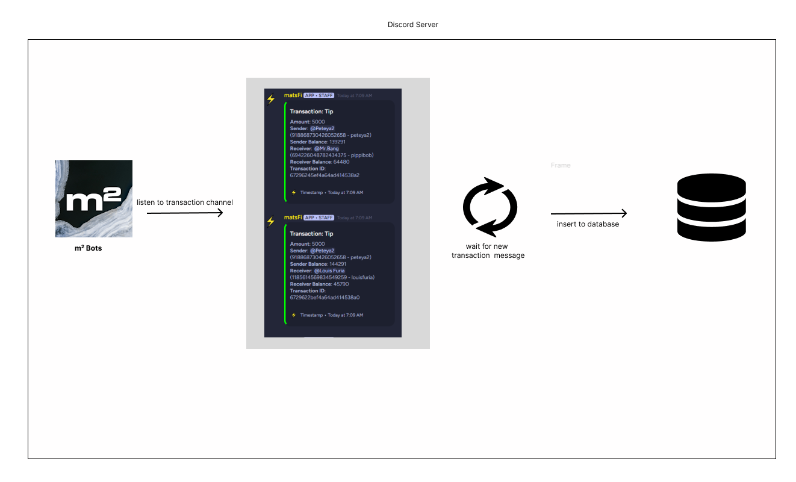

# m² Bots
m² is the incentive layer for matsFi. Inspired by Fluidity, the Blockchain Incentive Layer, m² rewards users for every transaction performed with mats, and incentivizes users for using their mats within the matsFi economy, instead of hoarding them within their wallet.
Fluidity’s slogan - “Money designed to be moved.”

For every transaction performed with mats, users are entered into a no loss lottery, where most of the time, you’ll earn a small cashback (maybe a 100 mats tip earns you 0.1 mats), or if you’re lucky, you’ll hit the jackpot and earn the lion’s share of the epoch’s remaining prize pool. (each epoch would last 24 hours and have a set prize pool, e.g. 1000 mats)

This is designed for every transaction on matsFi (works by listening to the transaction channel) and stimulates people to tip, play games (such as matsCraft) or in other words GET BUSY transacting on matsFi, as they stand a chance to win big with every transaction. And if not, some pretty sweet cashback.


# How It Works?
### m² bots will listen every transaction on `💸┆transactions` channel then will capture it as rewards.




## How Rewards Works?     

**TIP REWARDS**   
For Now 1 Mats Calculate As Rewards Is 0.001   

lets say you give tip 1000 mats         
so total yield is 0.001 * 1000 = 1


**Finalize TIP Rewards**  
Sender : 80% From Total Yield  
Receiver : 20% From Total Yield

**CASINO BETS REWARDS**  
Every User Bet On Casino It'll Be Added On Yield Pool Balance
If User Lose On The Game, User Will Get 20% Of Total His Bet As Yield

# Available Command

* `/dashboard` Showing Details About User Like Balance,Unclaimed Yield
* `/stats` Showing Stats About User Tip Count,Tip Spend,Bet Count,Bet Spend etc
* `/txs-scan` You Can Track Detail About Txs By Using Txid. using this command you can see the detail about transaction rewards.
* `/menu` Show Admin Dashboard ( Admin Or Specific Role Only)


# How To Run 

Rename The `.env.sample` To `.env` Then Use Your Configuration
```
TOKEN=DISCORD_TOKEN
DB_NAME=m2.db

DRIP_API_KEY=
BASE_URL=https://api.drip.re
REALM_ID=
REALM_POINT_ID=
```

```bash
pip3 -r requirements.txt # Install Requirements
python3 models.py # Initialize DB Table
python3 main.py # Run The Bot
```
#
